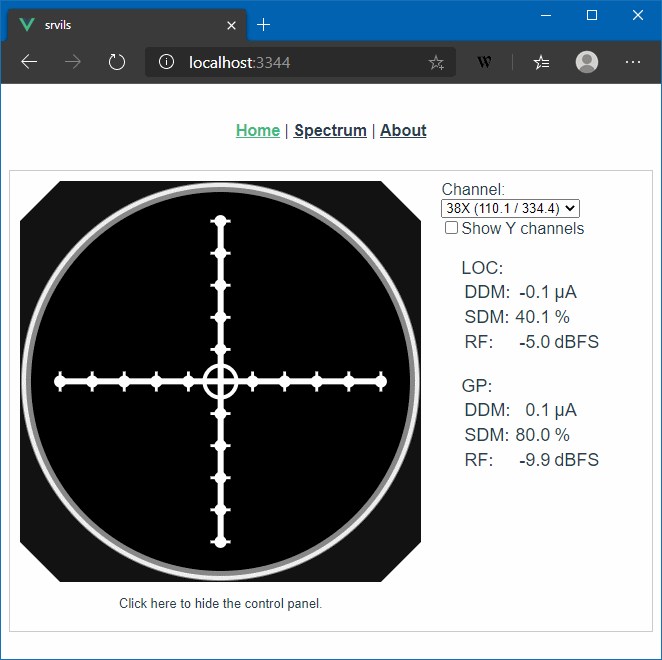

# dumpils and srvils

`dumpils` demodulates ILS signal and dumps the measurements
to stdout in CSV format.

`srvils` connects to two RTL-SDRs and serves a web application which displays a
CDI (Course Deviation Indicator) aircraft instrument as well as other measurements
on the radio signals.

Requires rtl_tcp to be running and listening on a TCP port (two instances for both LOC and GP).

## Install RTL-SDR driver

See https://osmocom.org/projects/rtl-sdr/wiki

On Windows, run zadig to disable the built in driver for RTL-SDR: https://zadig.akeo.ie/

## Running dumpils

dumpils reads measurements from a rtl_tcp server. Start rtl_tcp.exe first.

The ILS channel is by default 110.1 MHz.

Run with ```go run cmd/dumpils/main.go```

### Example
```text
C:\> .\dumpils.exe
RF(dbFS);DDM(uA);SDM(%);Ident
-4.4;-0.069;40.125;0.009
-4.3;111.194;18.989;0.193
-4.4;0.105;40.165;0.004
-4.4;-0.080;40.172;0.005
-4.4;0.034;40.171;0.006
-4.4;-0.032;40.174;0.000
-4.4;-0.034;40.178;0.003
-4.4;-0.015;40.177;0.006
-4.4;-0.029;40.174;0.004
-4.4;-0.035;40.172;0.003
Exiting on Ctrl-C.
```

## Running srvils

srvils takes two arguments, -gp and -loc, for specifying the sample-sources.

```
Usage of srvils:
  -gp string
        address and port of rtl_tcp or filename for GP data
  -loc string
        address and port of rtl_tcp or filename for LOC data
```

### Example


